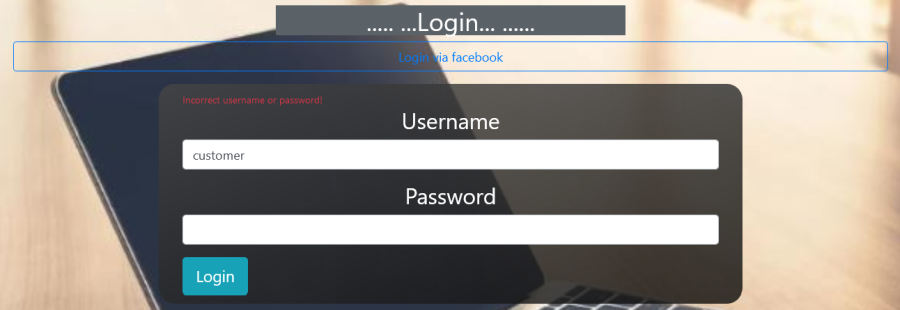
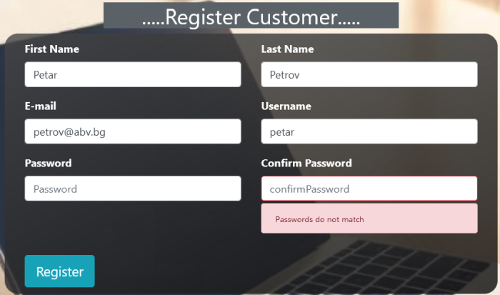
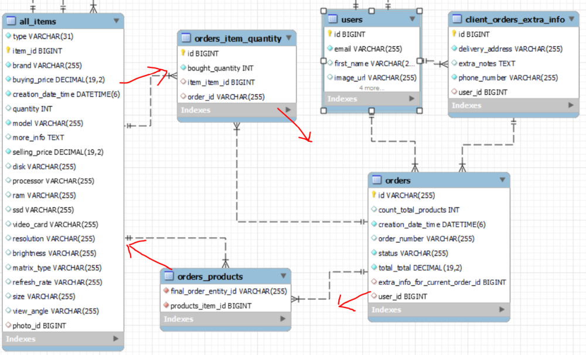
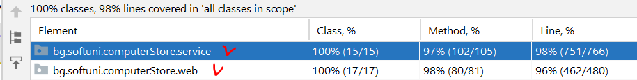

# Computer Store - diploma web project on JAVA and SPRING
# Online store for selling computers and computer components

## I. User functionality of the system
### Test credentials for the different users
* **!!!!! Please, do not delete the already defaultly created items/do not upload new photo for the already defaultly created items !!!!!!**
* **!!!!! You can create your own new Computer or Monitor that can edit and delete and upload photos to - when you log with user with role EMPLOYEE_PURCHASES - quickest way is to use username: purchase!!!!!!**
* Link to the website **https://computerstoreproject.herokuapp.com/**
* username: admin  password: 11111 - please do not delete the default items/please do not upload new photo for the default items
* username: customer  password: 11111
* username: sales  password: 11111 
* username: purchase  password: 11111 - please do not delete the default items/please do not upload new photo for the default items

### Customer functionality - **only for users who have a role CUSTOMER**
* Every person who visits the website can register and login in the website

* The register process sets this new user as a customer only - only role CUSTOMER

* Customers can add products in the basket, and make final orders

* Facebook social login feature implemented for customers only - in order this feature to work, it is necessary a Facebook Login for Business and advanced access to public_profile - i.e. business meta facebook account to be created and verified.
* When user is registered, we send a Welcome registration e-mail to the user - disabled in the deployed version of the project as currently sending to local MailHog email client.

### Choosing products in the Basket - only for logged customers - the user should have for sure a role CUSTOMER
* The basket with the added products can be accessed via the basket panel
* Each basket has status - either CLOSED or OPEN
* Every registered user has only 1 basket with one and the same number in the database - upon new user customer registration, the corresponding basket is created automatically
* Option for putting product items in the basket.
* When putting/adding a product in the basket we set by default 1 piece of that product item
* While putting/adding products in the basket, we deduct the available store stock quantity from that product
* The customer can also change the quantity he/she wants to buy - for each product in the basket

* The customer can also remove the whole product item off the basket - in such case we return the relevant quantity back to the available store stock quantity

* No matter which user and level of authorization - a basket can be seen only by its owner! So admin user also does not have access!

* Instead of 404

* Confirming the products in the basket - by continuing with the order finalization
* Scheduled event - for logged users - on every 5 minutes a scheduler makes a check if there are OPEN baskets with products generated more than 20 minutes ago and reset them automatically and set their status to CLOSED - when resetting any basket the system returns the quantity of each basket product back to the available store stock quantity

### The real final order
* Before the final order is confirmed, on a new page the customer enters also **delivery adddress**, **mobile number** and **notes**

* When the customer clicks the final confirmation button, then the system generates the final order which has now a number (generated by the UUID generator) - quantities are deducted now  off the system store stock.

* Displaying my final orders (that specific customer user has created) - sorted by datetime DESCENDING - the most recent order stays on the top of the list

* Or the systems displays all orders (for roles EMPLOYEE_SALES and/or ADMIN) of users capable to make orders

* When final order created, we increase the total numbers of orders - left upper corner. We also prepare (for now only logs) for sending order confirmation e-mail to the user and for adding bonus points to the user.

### Settings panel functionality - **for all users**
* Feature each user to be able to change his/her own password

* When the user is the ADMIN, it can be accessed from the admin panel
* When a successfull password change operation,  the system automatically logouts and a new login is required.

### ADMIN panel functionality - **only for role ADMIN**
* Employee of the store is any user with a role either EMPLOYEE_PURCHASES and/or EMPLOYEE_SALES
* Only user with ADMIN role can add a new employee - EMPLOYEE_PURCHASES and/or EMPLOYEE_SALES

* Every employee (seller, buyer) should have at least 2 roles (and max 3 roles) - any combination of CUSTOMER and EMPLOYEE_PURCHASES and EMPLOYEE_SALES
* Only user with ADMIN role can change the roles of employees (EMPLOYEE_PURCHASES and EMPLOYEE_SALES)

* There could be only 1 user with a role ADMIN, and he/she has all the 4 roles - ADMIN, EMPLOYEE_PURCHASES, EMPLOYEE_SALES, CUSTOMER
* Functionality for changing which user/employee to be the new and only ADMIN user - when the new ADMIN user is successfully set, the system automatically logouts and a new login is required.

* Statistics feature:
  * for count of total http requests by anonymous user and by a logged user.
  * for total number of orders, count of products sold, total revenue and total profit.

### PURCHASE functionality of the store - uploading computer products and update quantities - **only by role ADMIN or EMPLOYEE_PURCHASES**
* Option for adding, editing and deleting computer elements - I use the site www.ardes.bg as information when creating new items with photos
* Specificities/limitations/restrictions of the project: 
  * we keep always the model of each product item to be unique
  * the details view for ADMIN or EMPLOYEE_PURCHASES roles shows also `Current Quantity:`, `Update`, `Delete` and `Upload new photo` (as `Current Quantity:` is displayed also for EMPLOYEE_SALES role):

  

  * the model of the product always contains in its beginning the brand of the product - for example brand Lenovo, model Lenovo ThinkCentre Neo 50s SFF - 11SX002VBL
  * so, adding new item be like (beware of special characters in the model name!)

  

  

  * when we add a new item, if the model already exists, then we inform the user(the ADMIN or the EMPLOYEE_PURCHASES) that this model already exists and that he/she can only loads the page/the form for updating/editing and update item.

  

  * when clicking on the Update, the update item view appears - we accept that new buyingPrice and new sellingPrice will be valid for all the quantity of that model - sold or not yet. Usually we can better change other fields and of course we can add new quantity that the store bought.

  
  
  * when item is present in basket, this item cannot be deleted off the database

  * upload/change the photo of each item product. Each uploaded photo deletes automatically (also in the Cloudinary system) the previous uploaded photo for that computer item
  
  

### SALES functionality of the store **only by employees of the store with role EMPLOYEE_SALES or the ADMIN**
* Changing the status of an order:
  * After a customer confirms a final order, this order is processed into the database with status CONFIRMED_BY_CUSTOMER - as shown in **The real final order** section above.
  * The seller changes the status of the order manually to CONFIRMED_BY_STORE - after checking physically if the products are present in the store and after packaging the products, then the seller calls the courier Speedy or Econt sending the goods.
  
  

  * After the customer receives the goods from the order, the seller employee (EMPLOYEE_SALES or/and ADMIN) receives a notification by the courier for successful delivery and then changes the order status manually to DELIVERED.
  
  

* Status order - only for logged users - each user can see an order status - CONFIRMED_BY_CUSTOMER, CONFIRMED_BY_STORE or DELIVERED - but depending on the level of authorization - as we said users with roles EMPLOYEE_SALES and/or ADMIN can see all orders for all customers, but a user with role CUSTOMER can see only his/her own orders (if any).

### Tracing the count of total orders done
* In the upper left corner of the webpage we can see the total number of orders done so far by all customers

### Search
* Implemented client-side search for displaying/finding orders by order number via REST and Fetch API - for logged-in users:
  * Each user with roles either ADMIN and/or EMPLOYEE_SALES has access to change the order status - for all existing orders possible.
  * Each user with role CUSTOMER or with role EMPLOYEE_PURCHASES & CUSTOMER  has only the standard access - i.e. only access to his/her own orders, and not access to all orders.
  * It works sorted by default (by created datetime DESCENDING) **caseInsensitive** and the last added order appears first in the result list.

* Implemented server-side combined search for finding computers and integrated with Pagination and default sorted by price ASCENDING - the combined search criteria is by model name **caseInsensitive** (brand name is always a part of the model name) and by minSellingPrice and maxSellingPrice

## II. SoftUni Requirements done
### Initialization of initial data
* Initialization of the initial data - via InitialazbleService interfaces according to the  Open-Close SOLID principle - at init/AppInit.java class in @PostConstruct annotated method.
* Initialization from data.sql - see the end of this Readme file

### Used data structures
* Sets - for the user roles
* Lists - and we also return Unmodifiable when needed

### Transforming data
* Via ModelMapper
* Via MapStruct - plus one declared default mapping method (about the photo - from PictureEntity photo  to photo.getUrl())
* Manually - via constructor и setters

### Validating user html input data
* client-side via HTML (required, minlength="3", etc)
* server-side via @Valid annotation

### 3 custom annotation validations
* whether the username and the e-mail already exist in the database - when we register
* whether the pass and repass are one and the same/equal - when we register
* whether the buyingPrice and sellingPrice are valid whole or fractional number and not a text - when adding new products/amending existing products in the store

### Spring data, Hibernate and database
* using MySQL (implement/working also with PostgreSQL)
* implemented Single Table inheritance for all the products
* all tables interconnected one another relationally
* userId in our project is in reality always the  basketId  (userId === basketId in our project)
* at the moment the arranged relational connection between BasketOrderEntity and UserEntity is that each user is able to have more than one basket, but in our project we use in reality only one single basket per user (maybe in the future we may need more than 1 basket per user)
* Before the final order is confirmed, on a new page the customer enters also **delivery adddress**, **mobile number** and **notes** - this is a separate table client_orders_extra_info that is relationally connected with table orders and table users!
* Special feature for basket and order - we have a circle of 4 tables interconnected relationally and we can approach in both directions for anything we may need

### Cloudinary
* For uploading or for changing the picture of each product
* Each uploaded photo deletes automatically the previous uploaded photo - operations both in Cloudinary (the photo there is deleted) and in table pictures PictureEntity (we update here the row with the newly created photo in Cloudinary public_id and url).

### Interceptors
* Report for http request from anonymous users and authenticated users
* I18N – change language - just a demo for the header part and some title/paragraphs of pages - from English to Bulgarian and vice versa
* //ТODO  How many active users there are at the moment - we can display it on commons.html (or how many people visited the website)

### Generating HTML
* with Thymeleaf engine secured 
* and rest fetch API inside html for some pages

### Responsive Web Page Design 
* using Bootstrap

### Spring security
* via the security chain - not using @PreAuthorize on method level
* in thymeleaf html - hasRole(), isAuthenticated()
* via @AuthenticationPrincipal - secured MVC @Controller and @RestController JSON on method level:
  * adding/removing items or changing quantities of the basket or just viewing the basket
  * confirming basket into the final order
  * final order details
  * view final orders and change status of a final order.
* secured user role management
* secured password change
* secured admin user change
* secured adding new employee of Computer store

### Error Handling and security
1. Spring security default re-direct to login page for not allowed operations/wrong urls - from anonymous users
2. Adding a custom ComputerStoreErrorHandler
* disabling the default Spring whitelabel error.html page
* adding a custom ComputerStoreErrorHandler implementing the markup interface ErrorController - custom error pages for 404 Not Found, 403 Forbidden and 500 Internal Server Error.
* when wrong url error-404.html displayed; when correct url but not authorized error-403.html displayed
* picture for the error pages 404, 403 and 500

* Handled instead of 404

* Gif animated 404 page

3. More customs error handling experience with @ControllerAdvice
* using global application exception handling with @ControllerAdvice on all GET operations - connected with items, baskets, orders
* Exceptions for @ControllerAdvice for POST, PATCH, DELETE operations not needed as they are secured by the Spring security and CSRF (but I included them also for extra security)
4. Nobody can see other baskets and/or the page confirming the basket into a final order - except his/her own basket.
5. Only users who have roles EMPLOYEE_SALES and ADMIN can see all the final orders. EMPLOYEE_PURCHASES and CUSTOMER can see only their own orders.

### Loading data with FETCH api in the Thymeleaf html
* Adding, deleting and changing item quantities in the basket - via Rest and FETCH Api (jQuery and/or Vanilla JS)
* Calling dialog boxes based on the response status of the RestController:
  - for adding a new item in the basket (when successfully added new item, when we have already added this model in the basket, or when trying to add an item with zero quantity in the store available stock)
  - for deleting/removing an item off the basket
  - for changing item quantities of each item in the basket
* Displaying the user basket - via Rest and Fetch Api (jQuery and JS)
* Demo with text inlining - with Vanilla JS - for authorizing when displaying the orders
* Displaying orders, changing final order status and searching orders - according to user roles - via Rest and Fetch Api (jQuery and JS)
* Combined search when changing order status - when simultaneously search criteria present (entered by the user) and the user with role SALES, for example, is changing the order status, then after client-side rendering we visualize again only the orders matching the search criteria (and we keep the search criteria info displaying). In most cases we have searched for only 1 order, and thus this one and the same order we will not lose easily (and no need of new search) - we can change its status   twice   easy and quick.
* When order is on status CONFIRMED_BY_CUSTOMER, then we have only the option to change its status to CONFIRMED_BY_STORE
* When order is on status CONFIRMED_BY_STORE, then we have only the option to change its status to DELIVERED

###	Scheduling jobs and Spring events
* Schedule a job - for logged users - periodically, on every 5 minutes passed, resetting the baskets that became on status OPEN and with products in them  more than 20 minutes ago andnot yet CLOSED - after resetting the user basket, then we return the items quantities back to the available store stock quantity.
* Publish and Subscribe mechanism - using Spring event when an order is created - we catch the Spring custom event by Event listener - we increase the total numbers of orders. We also prepare (for now only logs) for sending e-mail to the user and for adding bonus points to the user.
* Specificity for displaying the total number of orders in the upper left corner of the webpage:
    - in commons.html we use the following Thymeleaf phrase:  ${#session.getAttribute('totalOrdersCount')
    - when we initially start/run our whole application, the initial automatically created orders do not catch the Spring event - I do not publish these events, so our custom event listener can not catch them. (in fact our event listener is registered quite later and for sure after the @PostConstruct annotated method is first executed. We can re-arrange the event listener to be registered earlier when the application starts, but the efforts showed that the @PostConstruct is again first executed) 
    - we set a global variable for keeping the total number of orders - as we take the initial number of orders from the database
    - we add on the  "http session cookie" the JSESSIONID attribute "totalOrdersCount" - when initial start of the whole application we display on the main webpage (at URL /), before logging (and after logging), the value of the above mentioned global variable for total number of orders made so far
    - we created a custom event class OrderCreatedEvent
    - we make an instance of OrderCreatedEvent and then publish it
    - created 3 classes that all contain a method annotated with @EventListener(OrderCreatedEvent.class) - for increasing number of total orders, and for e-mail sending to user and for bonus points
    - the event Listener for increasing number of orders catches the event  "created order", and increases the global static variable with plus 1
    - in the method viewOrderWithItemsAndAddAddressConfirm from the class BasketAndOrderController.java, at the last but one row and after the final order is finally created, we set a new value (already increased with 1)  on the attribute "totalOrdersCount" of JSESSIONID part of  http cookie session.

### Search
* Searching orders at the client-side and default sorted according to the user roles - via Rest and @RestController and Fetch Api (jQuery and JS)
* //TODO: We can make the search feature at the client-side rendering with Pagination functionality for the final orders - we should use JS via the rest and make all the logic for pageable in JS.
* Searching computers at the server-side with combined search criteria and integrated with Pagination and default sorted - via Thymeleaf and @Controller - combined search criteria by model name CASE SENSITIVE for now (brand name is always a part of the model name) and by minSellingPrice and maxSellingPrice using Specification and CriteriaBuilder
* //TODO: We can make a search feature at the server-side also for other items or we can make it a global search for all or specific types of product items

### Advice (AOP)
* Implemented Around Advice for tracking the latency of a few operations - adding an item to the basket, creating the final order, get sales statistics
* The latency info is saved in logs/logfile.log

### Unit and integration testing
### Coverage so far - service logic 751 lines (98%), web layer controllers 462 lines (96%). Global lines coverage - 1317 lines (61%)

* Integration testing in the web controllers and in the services - with in-memory database HyperSQL database and/or H2 database
* Important notes before starting testing:
  - first, disable in the class AppSeedInit.java  the @PostConstrict annotated method beginInit()
  - second, copy the real CLOUDINARY_SECRET in the application.yml in the test section // or other option is to set Enviromental Variables for every test class manually
* For testing - do not use columnDefinition @Column(name = "more_info", columnDefinition = "TEXT") - (in the ItemEntity class for field moreInfo, I removed the columnDefinition so that the in-memory HyperSQL / H2 grammar is satisfied)
* Testing with BasketServiceTest.java  - test each method separately as I am using @Transactional to re-enable the Hibernate session

### Pageable and sorted
* Server-side rendering implementation on the computers - with @Controller and in the Thymeleaf model
* Default page size 3
* Default sorting by sellingPrice ascending
* caseInsensitive search implemented

### Host the application in a cloud environment
* Deployed project via GitHub and manual deployment of only the current "main" branch
* Link to the website **https://computerstoreproject.herokuapp.com/**
* **!!!!! Please, do not delete the already defaultly created items/do not upload new photo for the already defaultly created items !!!!!!**
* **Important:** For re-deploying the project again, we should keep temporary somewhere the tests folders. We should delete the test folders from the github repo branch "main", then start the deployment, and after a successfull manual deployment of the current branch "main" state, we can add afterward the tests again in the github repo

### Demo with MailHog and javamail with Spring
* When user register, an automatic e-mail is sent to MailHog (Attention - disabled in the deployed version)

## III. General MORE TODOs
* Client-side rendering using Rest and @RestController and JS - the case when we have a form with POST http request and when we need to facilitate the CSRF in order such operation to be possible when Spring security with csrf enabled

* Initialization from data.sql file - possible
  sql:
  init:
  mode: never

* We can add more types of tiems, and it becomes easy
Keyboard and mice
Hard disk / SSD disk
Video card
Processor
Motherboard 
Ram

* A chat feature

* Possibility for non-logged user to add products in his/her basket. But in order to final-order them, he/she must log in – after a registration and a logging, the user basket should be preserved.
* For non-logged users - a scheduler for deleting/resetting on each 5 minutes baskets with status OPEN generated more than 20 minutes ago - when resetting the basket we return the item quantities back to the available store stock.

* If we have let's say 20 000 types of items and due to the limitation of our database for number of columns per table, then the extra info we can store as a nested JSONs