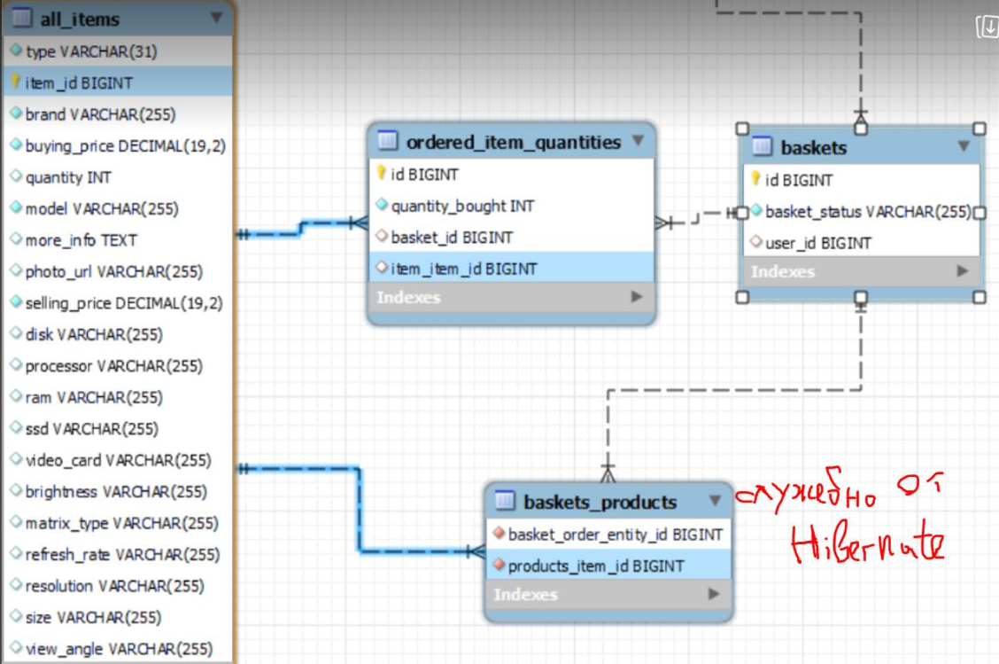

# Computer Store - diploma web project on JAVA and SPRING
# Online магазин за продажба на компютри и компютърни компоненти

## Functionality of the system
### Инициализация на първоначални данни
* Инициализация на първоначални данни - чрез InitialazbleService интерфейси съгласно Open-Close принципа - в init/AppInit.java class в @PostConstruct анотирания метод.
* Инициализация от data.sql - възможна, но Hibernatе не му харесва (виж края на този Readme файл)

### ADMIN панел функционалност - **само от ADMIN**
* Служител е user с роля/роли EMPLOYEE_PURCHASES или EMPLOYEE_SALES
* ADMIN може да добавя нов служител EMPLOYEE_PURCHASES или EMPLOYEE_SALES
* Сменяне на ролите нa потребителите EMPLOYEE_PURCHASES и EMPLOYEE_SALES
* Може да има само един ADMIN, и той има всичките четири роли
* Функционалност за смяна кой служител да е единствения ADMIN - при успешна смяна на admin, то системата се logout-ва автоматично и е нужен нов login
* Всеки служител (купувач, продавач) трябва да има поне 2 роли - обикновено CUSTOMER + EMPLOYEE_PURCHASES/EMPLOYEE_SALES
* Възможност за статистика:
  * за брой направени поръчки, брой артикули, на каква обща стойност, и колко печалба.
  * за брой http заявки на анонимен и на логнат потребител.

### Settings панел функционалност - **All users**
* Функционалност всеки потребител да си сменя паролата
* при ADMIN се достъпва от ADMIN панела
* при успешна смяна, то системата се logout-ва автоматично, и е нужен нов login

### Качване на оферти за компютри в сайта - **само от ADMIN и от EMPLOYEE_PURCHASES**
* Възможност за добавяне, редактиране и изтриване на компютърни компоненти.
* Ограничения: 
  * пазим уникален model на всеки item
  * при добавяне на нов item, ако моделът му съществува, то зареждаме формата за Update/Едит и само го update-ваме с нови данни.
  * приемаме, че при update/edit реално ако залагаме нови покупни и продажни цени, то тези цени са за всички бройки артикули от този модел. Променяме (добавяме) главно количество, но не само.
  * once a customer puts an item in his/her basket, it is not possible to delete the item
  * Може да има и редакция на снимка. Всяка качена снимка изтрива предишната снимка в Cloudinary, но Update-ва реда от PictireEntity (таблицата pictures) с новия public_id и url.

### Избор на продукти в Basket кошницата - само за логнати клиенти - **всеки потребител, който има и роля CUSTOMER**
* Всяка кошница има статус или CLOSED или OPEN
* Всеки регистриран потребител има само една единствена кошница под един и същи номер - при регистрация, то се добавя кошницата автоматично
* Възможност за поръчване и слагане в кошница/страница на продукти.
* При слагане на продукт от даден вид в кошница, то залагаме първоначална 1 бройка количество от този item
* При добавяне на количество продукти в кошницата, намаляме реалното налично количество продукти
* Възможност за изтриване на част от продуктите от кошницата - връщаме съответното количество обратно към наличното
* Потвърждаване на продуктите в кошницата - изтриване на кошницата и помощните таблици за тази кошница и създаваме на реална поръчката.
* Даване на номер реалната поръчка - чрез UUID генератора
* //TODO - за нелогнати потребители - не е готово - периодично минаване (на всеки 60 минути) за изтриване на кошници със статус OPEN (направени преди повече от 30 минути и все още незатворени) - при изтриване връщаме количеството на всеки Item обратно към наличното в магазина.

### Реалната поръчка
* При реална поръчка, клиента въвежда данни за **адрес на доставка**, **телефонен номер** и **бележки** - отделна таблица client_orders_extra_info, която е свързана и с таблица orders и с таблица users!
* Визуализиране на поръчките (сортирани по датачас - последна поръчка стои най-отгоре в списъка) - всички за даден user или абсолютно всички поръчки за user-и, които имат SALES и ADMIN роли
* Промяна на статус поръчка:
  * След като клиент потвърди поръчка, то тя се записва в базата данни на статус CONFIRMED_BY_CUSTOMER.
  * Продавача проверява физически дали ги има артикулите, пакетира доставката, сменя статуса на поръчката на CONFIRMED_BY_STORE, вика куриер – само от EMPLOYEE_SALES и от ADMIN.
  * След като пратката/поръчката е получена от клиента, продавача получава известие от куриера и променя ръчно статуса на поръчката на DELIVERED – само от EMPLOYEE_SALES и от ADMIN.
* Статус поръчка – проверка дали дадена поръчка е на статус CONFIRMED_BY_CUSTOMER, CONFIRMED_BY_STORE, DELIVERED. – от CUSTOMER, EMPLOYEE_SALES, ADMIN - за момента само за логнати потребители спрямо тяхното ниво на достъп.

### Особеност при basket и order
* Имаме един кръг от четири таблици свързани релационно и можем да подходим от две посоки за каквото и да е

### Search
* Имплементиран search за дисплейване/намиране на поръчки - работи само за логнати потребители и съответно достъпа е както следва:
Всеки ADMIN и EMPLOYEE_SALES имат достъп до промяна на статуса на поръчката - за всички поръчки.
Всеки потребител CUSTOMER или потребител PURCHASE & CUSTOMER има само стандартната информация - и то само за своите си поръчки, а не за всички поръчки.
* //TODO - глобална търсачка в commons.html за всички типове продукти - по тип на продукта + име на модел/цена по-голяма от... 

## Requirements done
### Използвани структури от данни
* Sets - за ролите
* Lists - като връщаме и Unmodifiable когато е неoбходимо

### Преубразуване на данни
* Чрез ModelMapper
* Чрез MapStruct - плюс един деклариран default mapping method (about the photo)
* Ръчно - чрез constructor и setters

### Validating input data
* client-side via HTML
* server-side via @Valid annotation

### Три custom annotation валидации
* За това дали username или e-mail вече съществуват в базата данни
* За това дали паролите се еднакви
* За това дали покупна и продажна цена са валидни

### Spring data, Hibernate and database
* using MySQL
* implemented Single Table inheritance for all the products
* all tables interconnected one another relationally

### Cloudinary
* За качване/смяна на снимка за всеки продукт

### Interceptors
* report for http request from anonymous and authenticated user
* I18N – change language - just a demo for the header part and some title/paragraphs of pages - from English to Bulgarian and vice versa
* //ТODO - YESS - колко потребителя има активни в момента - ще го дисплейваме на commons (NOOO!!! - how many people visited the website or the sales report)

### Generating HTML
* with Thymeleaf engine secured 
* and rest fetch API inside html for some pages

### Responsive Web Page Design 
* using Bootstrap

### Spring security
* only via the security chain! - not using @PreAuthorize on method level
* secured user role management
* secured password change
* secured admin user change
* secured adding new employee of Computer store
* secured (MVC and Rest JSON secured) adding items to the basket and from the basket to the final order - via @AuthenticationPrincipal

### Error Handling 
1. Spring security default re-direct to login page for not allowed operations/wrong urls - for anonymous users
2. Adding a custom ComputerStoreErrorHandler
* disabling the default Spring whitelable error.html page
* adding a custom ComputerStoreErrorHandler implementing the markup interface ErrorController - custom error pages for 404 Not Found, 403 Forbidden and 500 Internal Server Error.
* when wrong url error-404.html displayed; when correct url but not authorized error-403.html displayed
* picture for the error pages 404, 403 and 500
3. More customs error handling experience with @ControllerAdvice
* using global application exception handling with @ControllerAdvice on all GET operations
* Exceptions for @ControllerAdvice for POST, PATCH, DELETE operations not needed as they are secured by the Spring security and CSFR (but I included them also for extra security)

### Loading data with FETCH api in the Thymeleaf html
* Добавянето, изтриване и промяна количества на Item-s в кошницата чрез Rest и FETCH Api (jQuery and/or Vanilla JS)
* Дисплейване на всяка кошница - чрез Rest и Fetch Api (jQuery and JS)
* Demo with text inlining - with Vanilla JS - for authorizing when displaying the orders
* Дисплейване на поръчки, промяна статус на поръчка и търсене на поръчки - според ролите на user-а - чрез Rest и Fetch Api (jQuery and JS)
* Комбинирано търсене с промяна на статус - при едновременно зададен критерий за търсене и при смяна на статус поръчка, то се визуализират само поръчките отговарящи на търсения критерий (в повечето случай е само 1 поръчка), като по този начин на една и съща поръчка можем лесно без да търсим допълнително да й сменим на два пъти статуса
* Когато поръчка е на статус CONFIRMED_BY_CUSTOMER, то имаме опция да сменим статуса само на CONFIRMED_BY_STORE
* Когато поръчка е на статус CONFIRMED_BY_STORE, то имаме опция да сменим статуса само на DELIVERED

### Search
* Търсене на поръчки - според ролите на user-а - чрез Rest и Fetch Api (jQuery and JS)

**Others/ TODOs **
* Накрая на представянето на проекта, може да добавя за демо, да се инициализират и 2 монитора от data.sql файла, но по принцип не му харесва на Hibernate след това
* Сменяме от never на always, добавяме си 2 мониторa, a след това задаваме 'never' веднага преди ново пускане на системата
  sql:
  init:
  mode: never

* Можем да добавим и още артикули, и става сравнително лесно
Клавиатури и мишки
Хард диск / Hardisk / SSD disk
Видео карта/ Video card
Процесор / Processor
Дъно / Motherboard
Рам / Ram

* Подобие на чат (ако остане време)

* Pageable and sorted – to implement it. – лесно става в Java, но за да се display-не на html-a, то:
-	При client-side rendering трябва чрез JS да ги вземаме нещата.
-	При server-side rendering с обикновен контролер -  трябва в Thymeleaf модела да ги сложим
     Чрез Page . content вземаме лист от елементите от текущия Page, previous enabled, next enabled, previousPage, next

* Възможност за нелогнат потребител да си добавя продукти в кошница. За да ги поръча обаче трябва да се логне – след регистрация и логване, кошницата дали ще може да се запази.

* Възможност за статистика:
  * за брой клиенти и средна стойност в лева за една поръчка;

* При 20 000 артикула, то допълнителната информация може да я слагаме във вложени JSON-и