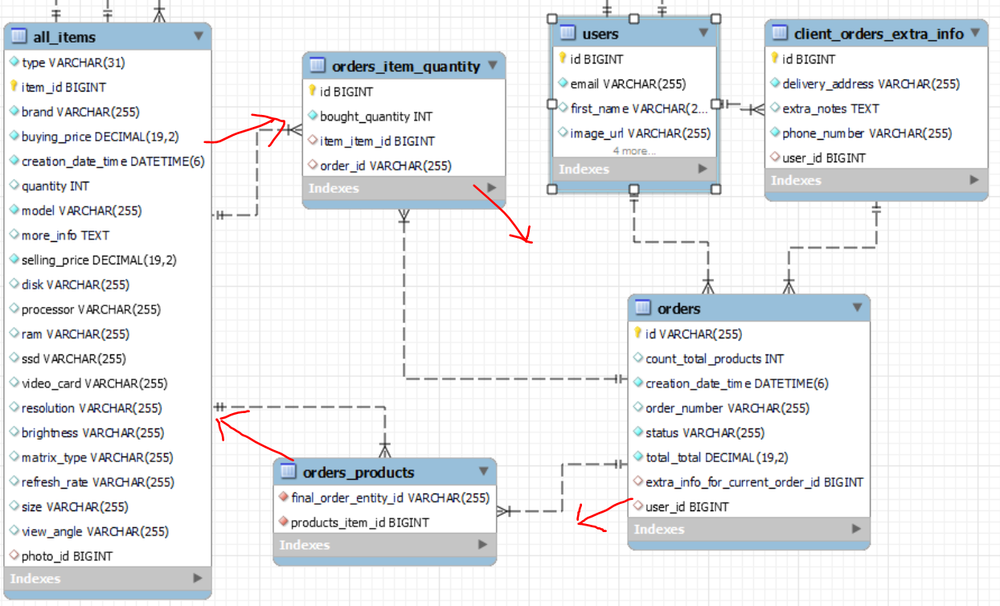

# Computer Store - diploma web project on JAVA and SPRING
# Online store for selling computers and computer components

## I. User functionality of the system
### Initialization of initial data
* Initialization of the initial data - via InitialazbleService interfaces according to the  Open-Close SOLID principle - at init/AppInit.java class in @PostConstruct annotated method.
* Initialization from data.sql - see the end of this Readme file

### ADMIN панел функционалност - **само от ADMIN**
* Служител е user с роля/роли EMPLOYEE_PURCHASES или EMPLOYEE_SALES
* ADMIN може да добавя нов служител EMPLOYEE_PURCHASES или EMPLOYEE_SALES
* Сменяне на ролите нa потребителите EMPLOYEE_PURCHASES и EMPLOYEE_SALES
* Може да има само един ADMIN, и той има всичките четири роли
* Функционалност за смяна кой служител да е единствения ADMIN - при успешна смяна на admin, то системата се logout-ва автоматично и е нужен нов login
* Всеки служител (купувач, продавач) трябва да има поне 2 роли - обикновено CUSTOMER + EMPLOYEE_PURCHASES/EMPLOYEE_SALES
* Възможност за статистика:
  * за брой направени поръчки, брой артикули, на каква обща стойност, и колко печалба.
  * за брой http заявки на анонимен и на логнат потребител.

### Settings панел функционалност - **All users**
* Функционалност всеки потребител да си сменя паролата
* при ADMIN се достъпва от ADMIN панела
* при успешна смяна, то системата се logout-ва автоматично, и е нужен нов login

### Качване на оферти за компютри в сайта - **само от ADMIN и от EMPLOYEE_PURCHASES**
* Възможност за добавяне, редактиране и изтриване на компютърни компоненти.
* Ограничения: 
  * пазим уникален model на всеки item
  * при добавяне на нов item, ако моделът му съществува, то уведомяваме потребителя, че той може да зареди формата за Update/Едит и само да го update-не артикула с нови данни.
  * приемаме, че при update/edit реално ако залагаме нови покупни и продажни цени, то тези цени са за всички бройки артикули от този модел. Променяме (добавяме) главно количество, но не само.
  * once a customer puts an item in his/her basket, it is not possible to delete the item from the database
  * Може да има и редакция на снимка. Всяка качена снимка изтрива предишната снимка в Cloudinary, но Update-ва реда от PictireEntity (таблицата pictures) с новия public_id и url.

### Избор на продукти в Basket кошницата - само за логнати клиенти - **всеки потребител, който има и роля CUSTOMER**
* Всяка кошница има статус или CLOSED или OPEN
* Всеки регистриран потребител има само една единствена кошница под един и същи номер - при регистрация, то се добавя кошницата автоматично
* Възможност за поръчване и слагане в кошница/страница на продукти.
* При слагане на продукт от даден вид в кошница, то залагаме първоначална 1 бройка количество от този item
* При добавяне на количество продукти в кошницата, намаляме реалното налично количество продукти
* Възможност за изтриване на част от продуктите от кошницата - връщаме съответното количество обратно към наличното
* Потвърждаване на продуктите в кошницата - изтриване на кошницата и помощните таблици за тази кошница и създаваме на реална поръчката.
* Даване на номер реалната поръчка - чрез UUID генератора
* Scheduled event - за логнати потребители - периодично минаване (на всеки 5 минути) за изтриване на кошници със статус OPEN (направени преди повече от 20 минути и все още незатворени) - при изтриване връщаме количеството на всеки Item обратно към наличното в магазина.

### Реалната поръчка
* При реална поръчка, клиента въвежда данни за **адрес на доставка**, **телефонен номер** и **бележки** - отделна таблица client_orders_extra_info, която е свързана и с таблица orders и с таблица users!
* Визуализиране на поръчките (сортирани по датачас - последна поръчка стои най-отгоре в списъка) - всички за даден user или абсолютно всички поръчки за user-и, които имат SALES и ADMIN роли
* Промяна на статус поръчка:
  * След като клиент потвърди поръчка, то тя се записва в базата данни на статус CONFIRMED_BY_CUSTOMER.
  * Продавача проверява физически дали ги има артикулите, пакетира доставката, сменя статуса на поръчката на CONFIRMED_BY_STORE, вика куриер – само от EMPLOYEE_SALES и от ADMIN.
  * След като пратката/поръчката е получена от клиента, продавача получава известие от куриера и променя ръчно статуса на поръчката на DELIVERED – само от EMPLOYEE_SALES и от ADMIN.
* Статус поръчка – проверка дали дадена поръчка е на статус CONFIRMED_BY_CUSTOMER, CONFIRMED_BY_STORE, DELIVERED. – от CUSTOMER, EMPLOYEE_SALES, ADMIN - за момента само за логнати потребители спрямо тяхното ниво на достъп.

### Проследимост на общия брой поръчки
* В горния ляв ъгъл се показва общия брой поръчки до момента
* Demo using Spring event when an order is created - we catch the Spring custom event by Event listener - we increase the total numbers of orders. We also prepare for sending e-mail to the user and for adding bonus points to the user.

### Search
* Implemented client-side search for displaying/finding orders by order number via REST and Fetch API - it works only for logged-in users and the authorization is as follows:
Each user with roles either ADMIN and/or EMPLOYEE_SALES has access to change the order status - for all existing orders possible.
Each user with role CUSTOMER or with rolse EMPLOYEE_PURCHASES & CUSTOMER  has only the standard access - i.e. only access to his/her own orders, and not access to any / all orders.
It works sorted by default (by created datetime DESCENDING) and the last added order appears first in the result list. 
* Implemented server-side combined search for finding computers and integrated with Pagination and default sorted by price ASCENDING - the combined search criteria is by model name (brand name is always a part of the model name) and by minSellingPrice and maxSellingPrice

## II. SoftUni Requirements done
### Used data srtuctures
* Sets - for the user roles
* Lists - and we also return Unmodifiable when needed

### Transforming data
* Via ModelMapper
* Via MapStruct - plus one declared default mapping method (about the photo - from PictureEntity photo  to photo.getUrl())
* Manually - via constructor и setters

### Validating user html input data
* client-side via HTML
* server-side via @Valid annotation

### 3 custom annotation validations
* whether the username and the e-mail already exist in the database - when we register
* whether the pass and repass are one and the same/equal - when we register
* whether the buyingPrice and sellingPrice are valid whole or fractional number and not a text - when adding new products/amending existing products in the store

### Spring data, Hibernate and database
* using MySQL
* implemented Single Table inheritance for all the products
* all tables interconnected one another relationally
* userId is in our project in realoty always basketId  (userId === basketId in our project)
* at the moment the arranged relational connection between BasketOrderEntity and UserEntity is that each user is able to have more than one basket, but in our project we use in reality only one single basket per user (maybe in the future we may need more than 1 basket per user) 
* Special feature for basket and order - we have a circle of 4 tables interconnected relationally and we can approach in both directions for anything we may need

### Cloudinary
* For uploading or for changing the picture of each product

### Interceptors
* report for http request from anonymous and authenticated user
* I18N – change language - just a demo for the header part and some title/paragraphs of pages - from English to Bulgarian and vice versa
* //ТODO  How many active users there are at the moment - we can display it on commons.html (NOOO!!! - how many people visited the website)

### Generating HTML
* with Thymeleaf engine secured 
* and rest fetch API inside html for some pages

### Responsive Web Page Design 
* using Bootstrap

### Spring security
* only via the security chain! - not using @PreAuthorize on method level
* secured user role management
* secured password change
* secured admin user change
* secured adding new employee of Computer store
* secured (MVC @Controller secured and also @RestController JSON secured - both via @AuthenticationPrincipal) - adding/removing items or changing quantities of the basket or just viewing the basket, confirming basket into the final order, final order details, view final orders and change status of a final order.

### Error Handling 
1. Spring security default re-direct to login page for not allowed operations/wrong urls - from anonymous users
2. Adding a custom ComputerStoreErrorHandler
* disabling the default Spring whitelable error.html page
* adding a custom ComputerStoreErrorHandler implementing the markup interface ErrorController - custom error pages for 404 Not Found, 403 Forbidden and 500 Internal Server Error.
* when wrong url error-404.html displayed; when correct url but not authorized error-403.html displayed
* picture for the error pages 404, 403 and 500
3. More customs error handling experience with @ControllerAdvice
* using global application exception handling with @ControllerAdvice on all GET operations - connected with items, baskets, orders
* Exceptions for @ControllerAdvice for POST, PATCH, DELETE operations not needed as they are secured by the Spring security and CSFR (but I included them also for extra security)
4. Nobody can see other baskets and/or the page confirming the basket into a final order - except his/her own basket.
5. Only users who have roles EMPLOYEE_SALES and ADMIN can see all the final orders. EMPLOYEE_PURCHASES and CUSTOMER can see only their own orders.

### Loading data with FETCH api in the Thymeleaf html
* Adding, deleting and changing item quantities in the basket - via Rest and FETCH Api (jQuery and/or Vanilla JS)
* Calling dialog boxes based on the response status of the RestController:
  - for adding a new item in the basket (when successfully added new item, when we have already added this model in the basket, or when trying to add an item with zero quantity in the store available stock)
  - for deleting/removing an item off the basket
  - for changing item quantities of each item in the basket
* Displaying the user basket - via Rest and Fetch Api (jQuery and JS)
* Demo with text inlining - with Vanilla JS - for authorizing when displaying the orders
* Displaying orders, changing final order status and searching orders - according to user roles - via Rest and Fetch Api (jQuery and JS)
* Combined search when changing order status - when simultaneously search criteria present (entered by the user) and the user with role SALES, for example, is changing the order status, then after client-side rendering we visualize again only the orders matching the search criteria (and we keep the search criteria info displaying). In most cases we have searched for only 1 order, and thus this one and the same order we will not lose easily (and no need of new search) - we can change its status   twice   easy and quick.
* When order is on status CONFIRMED_BY_CUSTOMER, then we have only the option to change its status to CONFIRMED_BY_STORE
* When order is on status CONFIRMED_BY_STORE, then we have only the option to change its status to DELIVERED

###	Scheduling jobs and Spring events
* Schedule a job - for logged users - periodically, on every 5 minutes passed, resetting the baskets that became on status OPEN and with products in them  more than 20 minutes ago andnot yet CLOSED - after resetting the user basket, then we return the items quantities back to the available store stock quantity.
* Using Spring event when an order is created - we catch the Spring custom event by Event listener - we increase the total numbers of orders. We also prepare for sending e-mail to the user and for adding bonus points to the user.
* Specificity for displaying the total number of orders at the upper left corner of the webpage:
    - in commons.html we use the following Thymeleaf phrase:  ${#session.getAttribute('totalOrdersCount')
    - when we initially start/run our whole application, the initial automatically created orders do not catch the Spring event - I do not publish these events, so our custom event listener can not catch them. (in fact our event listener is registered quite later and for sure after the @PostConstruct annotated method is first executed. We can re-arrange the event listener to be registered earlier when the application starts, but the efforts showed that the @PostConstruct is again first executed) 
    - we set a global variable for keeping the total number of orders - as we take the initial number of orders from the database
    - we add on the  "http session cookie" the JSESSIONID attribute "totalOrdersCount" - when initial start of the whole application we display on the main webpage (at URL /), before logging (and after logging), the value of the above mentioned global variable for total number of orders made so far
    - we created a custom event class OrderCreatedEvent
    - we make an instance of OrderCreatedEvent and then publish it
    - created 3 classes that all contain a method annotated with @EventListener(OrderCreatedEvent.class) - for increasing number of total orders, and for e-mail sending to user and for bonus points
    - the event Listener for increasing number of orders catches the event  "created order", and increases the global static variable with plus 1
    - in the method viewOrderWithItemsAndAddAddressConfirm from the class BasketAndOrderController.java, at the last but one row and after the final order is finally created, we set a new value (already increased with 1)  on the attribute "totalOrdersCount" of JSESSIONID part of  http cookie session.

### Search
* Searching of orders at the client-side and default sorted according to the user roles - via Rest and @RestController and Fetch Api (jQuery and JS)
* //TODO: We can make the search feature at the client-side rendering with Pagination functionality for the final orders - we should use JS via the rest and make all the logic for pageable in JS.
* //TODO:!!Not completely working yet !! Searching computers at the server-side and integrated with Pagination and default sorted - via Thymeleaf and @Controller - combined search criteria by model name (brand name is always a part of the model name) and by minSellingPrice and maxSellingPrice using CriteriaBuilder
* //TODO: We can make a search feature at the server-side also for other items or we can make it a global search for all or specific types of product items

### Advice (AOP)
* Implemented Around Advice for tracking the latency of a few operations - adding an item to the basket, creating the fina order, get sales statistics
* The latency info is saved in logs/logfile.log

### Unit and integration testing
### Coverage so far - service logic 751 lines (98%), web layer controllers 462 lines (96%). Global lines coverage - 1317 lines (61%)

* Integration testing in the web controllers and in the services - with in-memory database HyperSQL database and/or H2 database
* Important notes before starting testing:
  - first, disable in the class AppSeedInit.java  the @PostConstrict annotated method beginInit()
  - second, copy the real CLOUDINARY_SECRET in the application.yml in the test section // or other option is to set Enviromental Variables for every test class manually
* For testing - do not use columnDefinition @Column(name = "more_info", columnDefinition = "TEXT") - (in the ItemEntity class for field moreInfo, I removed the columnDefinition so that the in-memory HyperSQL / H2 grammar is satisfied)
* Testing with BasketServiceTest.java  - test each method separately as I am using @Transactional to re-enable the Hibernate session

### Pageable and sorted
* Server-side rendering implementation on the computers - with @Controller and in the Thymeleaf model
* Default page size 3
* Default sorting by sellingPrice ascending

### Host the application in a cloud environment
* //TODO:

## III. General MORE TODOs
* Client-side rendering using Rest and @RestController and JS - the case when we have a form with POST http request and when we need to facilitate the CSRF in order such operation to be possible when Spring security with csrf enabled

* Initialization from data.sql file - possible, but Hibernate do not like it (special hibernate_sequences should be set in order to work)
  sql:
  init:
  mode: never

* We can add more types of tiems, and it becomes easy
Keyboard and mice
Hard disk / SSD disk
Video card
Processor
Motherboard 
Ram

* A chat feature

* Possibility for non-logged user to add products in his/her basket. But in order to final-order them, he/she must log in – after a registration and a logging, the user basket should be preserved.
* For non-logged users - a scheduler for deleting/resetting on each 5 minutes baskets with status OPEN generated more than 20 minutes ago - when resetting the basket we return the item quantities back to the available store stock.

* If we have let's say 20 000 types of items and due to the limitation of our database for number of columns per table, then the extra info we can store as a nested JSONs